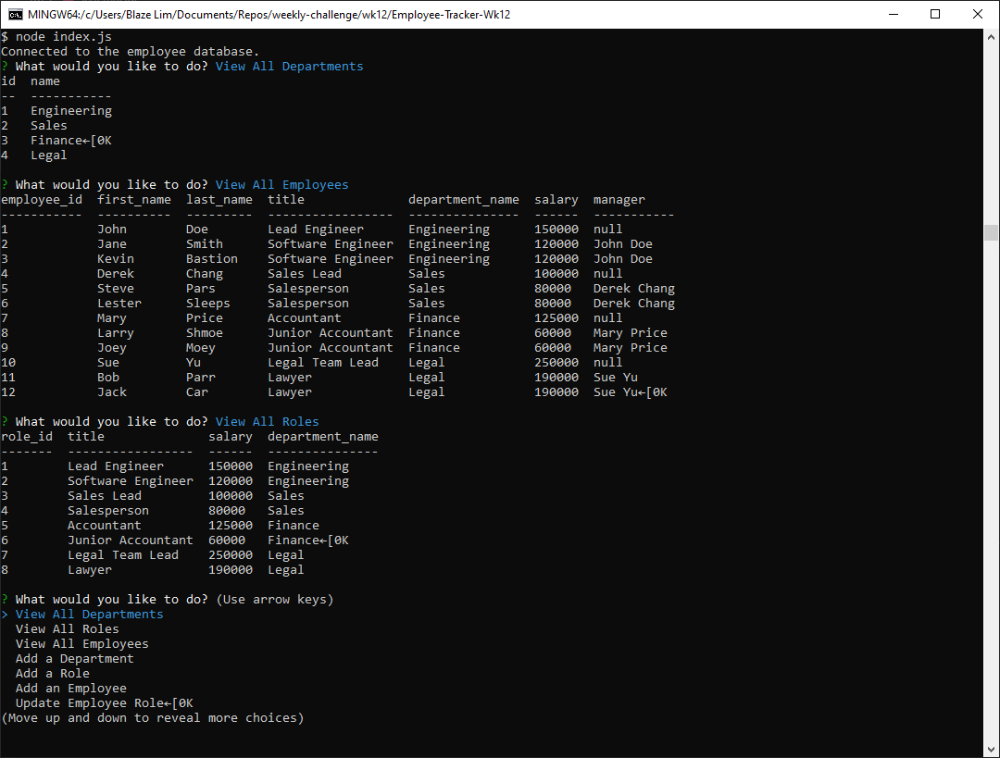

# Employee Tracker

## Description

An SQL based application that lets you manage a database of your employees. You can add departments, roles, and new employees. You can view your current departments, current roles, and current employees using the "View All" functions found in the application. Additionally you are able to update employee roles as they change
## Table of Contents
* [Installation](#installation)
* [Usage](#usage)
* [License](#license)
* [Questions](#questions)
## Installation
In the root directory of the application in your CLI, use the command 'npm install' to install any dependencies.

Modify the code in 'db/connections.js". Change the user and password to the username and password of your sql database.

Start the SQL database from your SQL command line. While in the root directory of the application, use the "SOURCE db/db.sql" command to start using the employee database. Additionally, during the FIRST time initializing this application, you must also install the tables into your employee database using the "SOURCE db/schema.sql" command. After that, your application is ready to go!

## Usage
In your command line in the root directory of the application, use the "node index.js" command

## License
This project is covered under the MIT license.
[Click here to see the terms of the license](https://choosealicense.com/licenses/mit/)
## Questions
Any questions or concerns?
Contact me on my github: [blazelim](https://github.com/blazelim/)

Or email me at: blazebentleycolim@gmail.com
